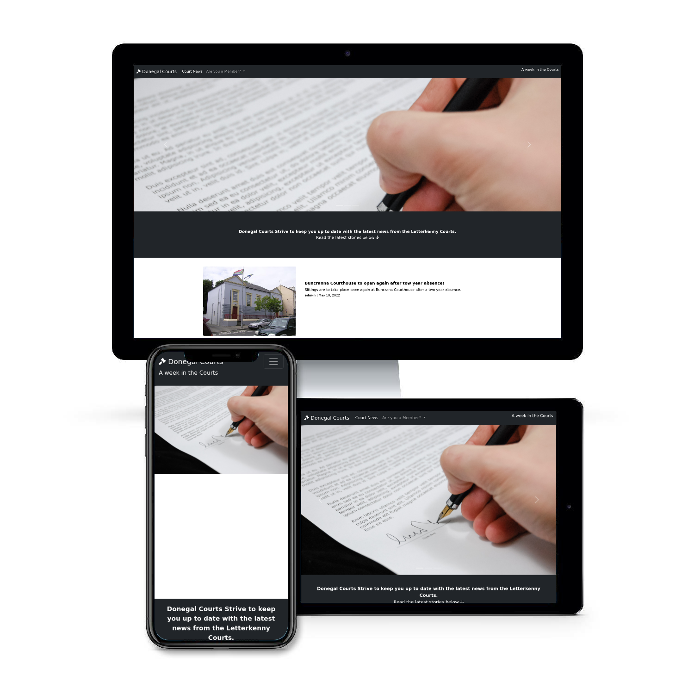

# Donegal Courts Blog
 

<a href="https://donegalcourts.herokuapp.com/" alt="link to donegal courts blog" target="_blank" rel="noopener">Link to The Donegal Courts Blog</a>

## Project Goals 
<ul>
    <li> The main goal of this project is to create a platform for locals of Donegal to have a place to read and stay informed about the goings on.</li>
    <li>It also aims to create a place for locals to have a public platform (through a comments section) about the stories that have come out of the recent court hearings.</li>
    <li> Finally, the blog will be fully functional from an admin point of view where the admin can manage posts and comments that will be display on the site. They are also responisble for adding content to the site, so any posts that are written need to be editable.</li>
</ul>

## Table of Contents
1. [Project Goals](#project-goals)
2. [User Experience](#user-experience)
    1. [Target Audience](#target-audience)
    2. [User Requirements](#user-requirements)
    3. [User Stories](#user-stories)
3. [Technical Design](#technical-design)
    1. [Flow Chart](#flow-chart)
    2. [Data Modeling](#data-modeling)
    3. [User Manual](#user-manual)
    4. [Google Spreadsheets](#google-spreadsheets)
4. [Technology](#technology)
    1. [Develpoment Languages Used](#develpoment-languages-used)
    2. [Frameworks and Tools used](#frameworks-and-tools-used)
5. [Features](#features)
6. [Testing](#testing)
    1. [Python Validation](#python-validation)
    2. [Testing user stories](#testing-user-stories)
7. [Bugs](#Bugs)
8. [Deployment](#deployment)
9. [Credits](#credits)
10. [Acknowledgements](#acknowledgements)
11. [Future Features](#future-features)

### User Experience:

### Target Audience 

The Donegal Courts blog was inspired by the local newspaper of Donegal - the Donegal News/ Derry people, so the target audience would be of readers of that or for people who are native to Donegal that live away and want to stay up to date. In short, the Target audience is mainly Donegal Natives or people who have Donegal Ties that want to stay up to date with the court listings. 

### User Requirements

As I have mentioned, the blog has a very niche target audience. However, the age demographics are quite broad and because of this the blog has to be easy to use for every age group. I have taken the following approach to make sure that all User Requirements to access and use the blog has been covered:

<ul>
    <li> Straightforward navigation through intro and game play, including a possibility to replay the game.</li>
    <li>The game has real time feedback for users which allows them to understand if their guess is right, wrong or invalid.</li>
    <li> The option to personalise the game by entering your name.</li>
</ul>

### User Stories

### First time and Recurring Stories
<ol>
    <li>As a user, I want to be able to play the hangman game that will test my knowledge of the Irish counties.</li>
    <li>As a user, I want to be able to use the game as a spelling test to revise for Irish Geography quizes at school.</li>
    <li>As a user, I would like to be able to personalise the game and enter my name.</li>
    <li>As a user who is not tech savy, I want to be able know how to play the game with very little technical advancity.</li>
    <li>As a user who doesn't understand websites, I want to easily see if I have guessed the question wrong or right.
    </li>
    <li>As a user, i want real time feedback telling me if my guess was right or wrong.</li>
</ol>

### Site's Owner Stories
<ol>
    <li>As the owner of the site, I want my potential users to have a place where they can enter their name that will be linked to a database that will show me if the game was replayed or not.</li>
    <li>As the owner, I want to have a game that will create a positive experience for the players of the game.</li>
    <li>As the owner, I want a game that is accessible to anyone.</li>
    <li>As the owner, I want a game that, will offer the user real time feedback.</li>
</ol>

## Technical Design

### Flow Chart

 I used the flow chart to design a clear map of my site that would help me design the functionality of the site and the logic and guidence for user stories. I did this by using Lucid Chart

Flow Chart

        

### Data Modeling

 After some research before starting the project, I decided that I didn't need to use Object Orientated Programming. The way I understand OOP is that it is used to seperate data into useful sections then within the programe to section off the functions that manipulate the data into methods, so you can control how the data is managed and also have the code in neat sections. I felt that with the hangman game I wouldn't use this. I don't have individually functioning parts as everything will work together.

 I did use lists within my code so I could easily use stored data that I needed to pass through functions in the run.py file.

Google Spreadsheets API: Justification: I have used the GSPREAD API in my code so that the required data from the code can be used outside the game and into the google spreadsheet.

### User Manual:
<ol>
<li>Once the user enters their name into the game the user will be able to play the game. The code for this game will generate a random letter from the words.py string. This word has to be guessed by the player.</li>
<li> The user has 6 attempts at guessing the word - If the player guesses a letter that is in the word the letter will appear in the word display to help the player make further correct guesses.</li>
<li>If the letter they guessed is not in the word the stickman will be drawn to create the hangman display.</li>
<li> If the player ends up guessing the correct word in the given amount of guesses then the player wins.</li>
<li> If not the stickman is hanged and the user loses.</li>
</ol>

### Google Spreadsheets:

I used Google Spreadsheets as a database that would record the information logged by the players of the game - ie. Name and if they replayed the game. I thought recording this data in particular would help with website analytics. The company that runs the game could see if the game was replayed and fun for the user or If they potentionally got frustrated and didn't play again.

Google Spreadsheet

        

 The spreadsheet is very basic as in it only has two headings- user name and if they replayed the game. In the future I hope to add to the game a basic or hard version of the game and then record that in the spreadsheet.
   

Here is a link to my spreadsheet: https://docs.google.com/spreadsheets/d/1Kv6gYod8qPLaEcLNhIDdd2mJUdZzBqcSu1wEqHsS4YQ/edit?usp=sharing
     

### Technology:

### Develpoment Languages Used

<ul>
<li> Python </li>
</ul>

###  Frameworks and Tools used
<ul>
<li> Git, GitHUb, and GitPod </li>
<li> Lucid Chart </li>
<li> Heroku </li>
<li> Google Sheets </li>
<li> Google Cloud Platform </li>
</ul>

### 3rd Party Libraries:
<ul>
<li>GSPREAD:JUSTIFICATION: I used gspread, to add and manipulate data in my Google spreadsheet and to interact with Google APIs.</li>
<li>RANDOM: JUSTIFICATION: I used random to generate the random words from my words.py file to display in the game for users to guess.</li>
</ul>

## Features:

This site has only one page, but the flow of the game is broken into a few parts.

### Introduction

<ul>
    <li>The introduction of the game is split into two parts - A logo that displayes the name of the game and the input section for the user to input their name.</li>
    <li> This allows the user to easily see the name of the game they are playing and also input their name to the system so they can have a personalised experience of the site.</li>
</ul>
 
User Stories covered : 3

 
Site Owner's Stories covered: 1

        

Introduction

        

#### Game
<ul>
    <li>The welcome section of the site offers the users to play the hangman game.</li>
    <li> The user is prompted to input a single letter and if it is wrong the stickman is drawn.</li>
    <li> If the guess is right then the user is told that they have guessed correctly.</li>
    <li> If the user guesses all the letters right befire the stickman is hanged then the user is told they are the winner. If not the user is told that they lost because they ran out of guesses.</li>
    <li> When the user is finnished with the game, the game will ask if the user wants to replay the game.<li>
</ul>
    
 User Stories covered: 1, 2, 4, 5, 6

    
Site Owner's Stories covered: 2, 3, 4

        

Game Display

        

        

Winner

        

        

Loser

        

## Testing:

### Python Validation

 To Validate my Python I used the PEP8 Online Validation Service. All python code passed its Validation with no errors but one warnings as shown below in the pictures.

Run.py Validation

Words.py Validation

### Testing User Stories

    1."As a user, I want to be able to play the hangman game that will test my knowledge of the Irish counties."
| **Feature** | **Action** | **Expected Result** | **Actual Result** |
|-------------|------------|---------------------|-------------------|
| Game Dispay | Once passed the introduction screen the user will enter the game | Plays the game and tests their knowledge to the users satisfaction. |    Works as expected |

User Testing 1

    2."As a user, I want to be able to use the game as a spelling test to revise for Irish Geography quizes at school."
| **Feature** | **Action** | **Expected Result** | **Actual Result** |
|-------------|------------|---------------------|-------------------|
| Game Dispay | Once passed the introduction screen the user will enter the game | Plays the game and tests their knowledge to the users satisfaction. | Works as expected |

User Testing 2

    3."As a user, I would like to be able to personalise the game and enter my name."
| **Feature** | **Action** | **Expected Result** | **Actual Result** |
|-------------|------------|---------------------|-------------------|
|Intro page offers name input | User enters their name in the prompted input and is addressed personally | Enjoys the personalised aspect of the game |   Works as expected |

User Testing 3

    4."As a user who not tech savy, I want to be able know how to play the game with very little technical advancity."
| **Feature** | **Action** | **Expected Result** | **Actual Result** |
|-------------|------------|---------------------|-------------------|
|Simple Navigation through prompts the user has to answer| Once the user is playing the game the user can't move on without answering the prompts on the screen| Able to play the game without frustration and confusion| Works as expected |

User Testing 4

    5."As a user who doesn't understand websites, I want to easily see if I have guessed the question wrong or right."
| **Feature** | **Action** | **Expected Result** | **Actual Result** |
|-------------|------------|---------------------|-------------------|
| Feedback through game play | Once playing the user will be told if their guess is right or wrong by the game| Guesses the word right depending on the answer they have previously guessed| Works as expected |

User Testing 5

    6."As a user, i want real time feedback telling me if my guess was right or wrong."
| **Feature** | **Action** | **Expected Result** | **Actual Result** |
|-------------|------------|---------------------|-------------------|
| Feedback through game play | Once playing the user will be told if their guess is right or wrong by the game| Guesses the word right depending on the answer they have guessed| Works as expected |

User Testing 6

### Testing Site Owner's Stories

    1."As the owner of the site, I want my potential users to have a place where they can enter their name that will be linked to a database that will show me how long the user has stayed on the website."
| **Feature** | **Action** | **Expected Result** | **Actual Result** |
|-------------|------------|---------------------|-------------------|
|Intro page offers name input | User enters their name in the prompted input and is addressed personally | Enjoys the personalised aspect of the game |  Works as expected |

User Testing 7

    2."As the owner, I want to have a game that will create a positive experience for the players of the game."
| **Feature** | **Action** | **Expected Result** | **Actual Result** |
|-------------|------------|---------------------|-------------------|
|Game play | Simple navigation and game play | The game is simple but fun and aims to create a positive experience | Works as expected |

User Testing 8

    3."As the owner, I want a game that is accessible to anyone."
| **Feature** | **Action** | **Expected Result** | **Actual Result** |
|-------------|------------|---------------------|-------------------|
| Simple style Navigation | Navigation allows users a restricted choice (Restricted as it doesn't allow too many decisions) | Play the game easily |   Works as expected |

User Testing 9

    4."As the owner, I want a game that, will offer the user real time feedback."
| **Feature** | **Action** | **Expected Result** | **Actual Result** |
|-------------|------------|---------------------|-------------------|
| Feedback through game play | Once playing the user will be told if their guess is right or wrong by the game| Guesses the word right depending on the answer they have guessed| Works as expected|

User Testing 10

## Bugs:

| **Bug** | **Fix** |

 I have not found any bugs in my code.

## Deployment:

In order to deploy my site I took the following steps using GitHub pages and Heroku:

<ol>
<li> Clone or Fork my repository.</li>
<li> Create an account in the Heroku app, and within that create a new app.</li>
<li> Add a "Config Var" with a key 'PORT' and value '8000' in Heroku's settings.</li>
<li> Add buildbacks firstly for the python code, and then again for NodeJS.</li>
<li> Then link the app to the repository using the following steps:</li>
<ul>
<li>Manually - Click to deploy branch </li> 

or

<li>Enable automatic deploys and follow the prompted instructions.</li>
</ul>
</ol>

 My link is: https://ci-pp3-hangman.herokuapp.com/ 

 Forking the repository is done by the following steps:

<ol>
<li>Within the GitHub repository, click "Fork" (a button) at the upper right hand corner.</li></ol>

 Cloning the repository is done by the following steps:

<ol>
<li>Within the GitHub repository, locate "Code" (a button) found at the top of the page.</li>
<li> Once selected, select which you prefere out of the following choise: HTTPS, SSH or GitHub CLI and press the copy URL to your clipboard.</li>
<li> Then open Git Bash.</li>
<li> Change the current directory to your desired location for the cloned directory.</li>
<li>Finally, type "git clone" and paste your URL.</li>
<li>Once you press enter your local clone is created.</li></ol>

## Credits:
### Source Code Used in Site

 Due to limitations in my knowledge I used youtube tutorials/ stack overflow articles to guide me with creating the game:

<ul>
<li>https://www.youtube.com/watch?v=m4nEnsavl6w&t=474s</li>
<li>https://www.youtube.com/watch?v=5x6iAKdJB6U</li>
<li>https://stackoverflow.com/questions/40781295how-to-find-the-first-empty-row-of-a-google-spread-sheet-using-python-gspread?fbclid=IwAR06xiD8fNg9KDe32-XocJSBfQcJAXMlOBv01zqZujAB3FAGcAut97e_jmo</li>
</ul>

 I used these videos/ articles soley as a guide I did not copy and paste.

## Acknowledgements:

 I would like to take this oppurtuinity to thank and acknowlege the following people:
<ul>
<li> I would like to thank Mo Shami - my mentor - for his feedback and guidence whilst creating the project.</li>
<li> I would like to thank those on the code institute slack channel for help with any issues I had.</li>
<li> I would also like to thank Conor lawton who helped me with understanding some of the code.</li>
</ul>

## Future Features

 I would like this section to explore what I would do if I had more time / expertise. I would add the ability for the user to decide to do a beginer or experienced version of the game. I believe that adding an easy or hard aspect to the game would sdvance the user stories more but as the game sits now the stories aren't comprimised and are still fullfilled.

 I would also like to add to the database if the user scored correctly or incorrectly when guessing a word to further aid the site owner on understanding potential reasons for the user not replaying the game.
