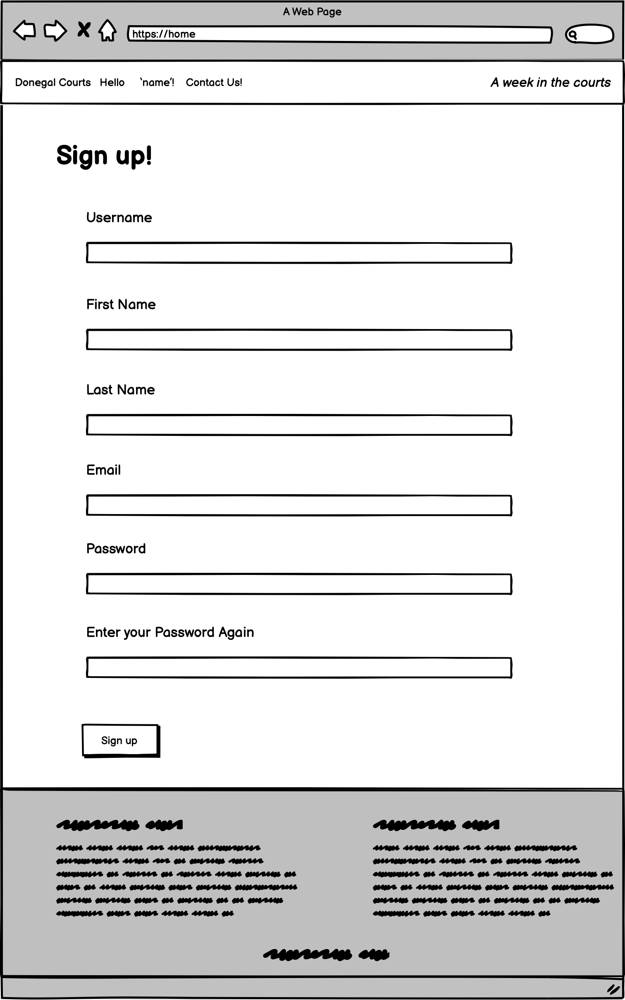

# Donegal Courts Blog
 

<a href="https://donegalcourts.herokuapp.com/" alt="link to donegal courts blog" target="_blank" rel="noopener">Link to The Donegal Courts Blog</a>

## Project Goals 
<ul>
    <li> The main goal of this project is to create a platform for locals of Donegal to have a place to read and stay informed about the goings on.</li>
    <li>It also aims to create a place for locals to have a public platform (through a comments section) about the stories that have come out of the recent court hearings.</li>
    <li> Finally, the blog will be fully functional from an admin point of view where the admin can manage posts and comments that will be display on the site. They are also responisble for adding content to the site, so any posts that are written need to be editable.</li>
</ul>

## Table of Contents
1. [Project Goals](#project-goals)
2. [User Experience](#user-experience)
    1. [Target Audience](#target-audience)
    2. [User Requirements](#user-requirements)
    3. [User Stories](#user-stories)
3. [Technical Design](#technical-design)
    1. [Flow Chart](#flow-chart)
    2. [Database Diagram](#database)
    3. [User Manual](#user-manual)
    4. [Wireframes](#wireframes)
4. [Technology](#technology)
    1. [Develpoment Languages Used](#develpoment-languages-used)
    2. [Frameworks and Tools used](#frameworks-and-tools-used)
5. [Features](#features)
6. [Testing](#testing)
    1. [Python Validation](#python-validation)
    2. [HTML Validation](#html-validation)
    3. [CSS Validation](#css-validation)
    4. [JavaScript Validation](#javascript-validation)
    5. [Accessibility] (#accessibility)
    6. [Performance] (#performance)
    7. [Testing user stories](#testing-user-stories)
7. [Bugs](#Bugs)
8. [Deployment](#deployment)
9. [Credits](#credits)
10. [Acknowledgements](#acknowledgements)
11. [Future Features](#future-features)

### User Experience:

### Target Audience 

The Donegal Courts blog was inspired by the local newspaper of Donegal - the Donegal News/ Derry people, so the target audience would be of readers of that or for people who are native to Donegal that live away and want to stay up to date. In short, the Target audience is mainly Donegal Natives or people who have Donegal Ties that want to stay up to date with the court listings. 

### User Requirements

As I have mentioned, the blog has a very niche target audience. However, the age demographics are quite broad and because of this the blog has to be easy to use for every age group. I have taken the following approach to make sure that all User Requirements to access and use the blog has been covered:

<ul>
    <li>Have a clear understanding of the layout of the site -> clear navigation.</li>
    <li>The blog has to be formal and factual, information on the site has to be easily accessibile to the user.</li>
    <li>The option of customizing the blog posts by the owner has to be limited ot the authorisation. A random user of the blog can not have permition to comment or post on the blog.</li>
    <li> As the topics discussed on the site contain sensitive information,I want the admin to be able to choose what comments get posted or not.
</ul>

### User Stories

### First time and Recurring Stories
<ol>
    <li>As a user of the site, I want to be able to Browse through content on the website.</li>
    <li>As a user of the site, I want to be able to View Court News Stories.</li>
    <li>As a user of the site, I want to be able to View Court News Stories in a List.</li>
    <li>As a user of the site, I want to be able to open and read the court news stories.</li>
    <li>As a user of the site, I want to be able to View comments under each post.</li>
    <li>As an authorized user of the site, I want to be able to Post Comments. </li>
    <li>As a user of the site, I want to be able to Register for an account.</li>
</ol>

### Site's Owner Stories
<ol>
    <li>As an authorized owner of the site, I want to be able to Post Stories to the site.</li>
    <li>As an authorized owner of the site, I want to be able to Create story drafts to come back to.</li>
    <li>As an authorized owner of the site, I want to be able to Manage site content.</li>
    <li>As an authorized owner of the site, I want to be able to Manage comments under posts.</li>
</ol>

## Technical Design

### Flow Chart

 I used the flow chart to design a clear map of my site that would help me design the functionality of the site and the logic and guidence for user stories. I did this by using Lucid Chart

Flow Chart

        

### Database 

 My Database has three models:

 My project uses the relational databse -> PostgreSQL.

 The data is handeled within the application with Django. 

<ul>
<li> Profile </li>
<li> Post </li>
<li> Comment </li>
<li> ---- </li>
</ul>

 Post and Comment have a many to one relationship and also uses the imported User class model for username and user unigue passwords.

Database Diagram

        

 

### User Manual:
<ol>
<li>---</li>
<li> ----</li>
<li>----</li>
<li> ----</li>
<li> ----</li>
</ol>

### Wireframes:

Home Page

        

Home Page: Membership Option

        

Login

        

Register

        

Home page: Loggined-In User

        

Blog Post

        

Blog Post: Edit

            

Blog Post: Delete

            

Blog Post: Create

            

        

### Technology:

### Develpoment Languages Used

<ul>
<li> Python </li>
</ul>

###  Frameworks and Tools used
<ul>
<li> Git, GitHUb, and GitPod </li>
<li> Lucid Chart </li>
<li> Heroku </li>
<li> Django </li>
<li> BootStap </li>
</ul>

### 3rd Party Libraries:
<ul>
<li>------</li>
<li>------</li>
</ul>

## Features:

----

### Home

<ul>
    <li>------</li>
</ul>
 
User Stories covered : -

 
Site Owner's Stories covered: -

        

Home

        

#### Game
<ul>
    <li>----</li>
    <li> ----</li>
    <li> ----</li>
    <li> ----</li>
    <li> ----<li>
</ul>
    
 User Stories covered: -

    
Site Owner's Stories covered: -

        

----

        

        

----

        

        

----

        

## Testing:

### Python Validation

 To Validate my Python I used the PEP8 Online Validation Service. All python code passed its Validation with no errors but one warnings as shown below in the pictures.

-

-

### Testing User Stories

    1."--"
| **Feature** | **Action** | **Expected Result** | **Actual Result** |
|-------------|------------|---------------------|-------------------|

User Testing 1

    2."."
| **Feature** | **Action** | **Expected Result** | **Actual Result** |
|-------------|------------|---------------------|-------------------|

User Testing 2

    3."."
| **Feature** | **Action** | **Expected Result** | **Actual Result** |
|-------------|------------|---------------------|-------------------|

User Testing 3

    4.""
| **Feature** | **Action** | **Expected Result** | **Actual Result** |
|-------------|------------|---------------------|-------------------|

User Testing 4

    5.""
| **Feature** | **Action** | **Expected Result** | **Actual Result** |
|-------------|------------|---------------------|-------------------|

User Testing 5

    6.""
| **Feature** | **Action** | **Expected Result** | **Actual Result** |
|-------------|------------|---------------------|-------------------|

User Testing 6

### Testing Site Owner's Stories

    1.""
| **Feature** | **Action** | **Expected Result** | **Actual Result** |
|-------------|------------|---------------------|-------------------|

User Testing 7

    2.""
| **Feature** | **Action** | **Expected Result** | **Actual Result** |
|-------------|------------|---------------------|-------------------|

User Testing 8

    3.""
| **Feature** | **Action** | **Expected Result** | **Actual Result** |
|-------------|------------|---------------------|-------------------|

User Testing 9

    4.""
| **Feature** | **Action** | **Expected Result** | **Actual Result** |
|-------------|------------|---------------------|-------------------|

User Testing 10

## Bugs:

| **Bug** | **Fix** |

 I have not found any bugs in my code.

## Deployment:

In order to deploy my site I took the following steps using GitHub pages and Heroku:

<ol>
<li> Clone or Fork my repository.</li>
<li> Create an account in the Heroku app, and within that create a new app.</li>
<li> Add a "Config Var" with a key 'PORT' and value '8000' in Heroku's settings.</li>
<li> Add buildbacks firstly for the python code, and then again for NodeJS.</li>
<li> Then link the app to the repository using the following steps:</li>
<ul>
<li>Manually - Click to deploy branch </li> 

or

<li>Enable automatic deploys and follow the prompted instructions.</li>
</ul>
</ol>

 My link is: https://ci-pp3-hangman.herokuapp.com/ 

 Forking the repository is done by the following steps:

<ol>
<li>Within the GitHub repository, click "Fork" (a button) at the upper right hand corner.</li></ol>

 Cloning the repository is done by the following steps:

<ol>
<li>Within the GitHub repository, locate "Code" (a button) found at the top of the page.</li>
<li> Once selected, select which you prefere out of the following choise: HTTPS, SSH or GitHub CLI and press the copy URL to your clipboard.</li>
<li> Then open Git Bash.</li>
<li> Change the current directory to your desired location for the cloned directory.</li>
<li>Finally, type "git clone" and paste your URL.</li>
<li>Once you press enter your local clone is created.</li></ol>

## Credits:
### Source Code Used in Site

 Due to limitations in my knowledge I used youtube tutorials/ stack overflow articles to guide me with creating the game:

<ul>
<li></li>
<li></li>
<li></li>
</ul>

 I used these videos/ articles soley as a guide I did not copy and paste.

<ul><li> Photos :Photo by Tarzine Jackson from Pexels</li>

<>

## Acknowledgements:

 I would like to take this oppurtuinity to thank and acknowlege the following people:
<ul>
<li> I would like to thank Mo Shami - my mentor - for his feedback and guidence whilst creating the project.</li>
<li> I would like to thank those on the code institute slack channel for help with any issues I had.</li>
<li> I would also like to thank Conor lawton who helped me with understanding some of the code.</li>
</ul>

## Future Features

--

