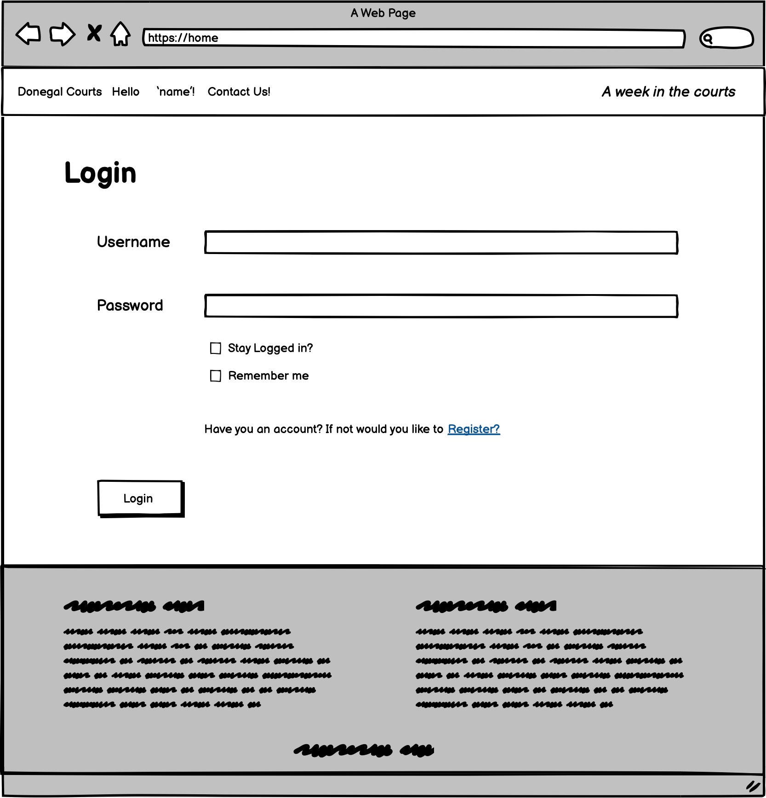

# Donegal Courts Blog
 

<a href="https://donegalcourts.herokuapp.com/" alt="link to donegal courts blog" target="_blank" rel="noopener">Link to The Donegal Courts Blog</a>

## Project Goals 
<ul>
    <li> The main goal of this project is to create a platform for locals of Donegal to have a place to read and stay informed about the goings on.</li>
    <li>It also aims to create a place for locals to have a public platform (through a comments section) about the stories that have come out of the recent court hearings.</li>
    <li> Finally, the blog will be fully functional from an admin point of view where the admin can manage posts that will be display on the site. They are also responisble for adding content to the site, so any posts that are written need to be editable. they can also choose once comments are posted by users that if the comment is abusive or harmfile thay can be deleted.</li>
</ul>

## Table of Contents
1. [Project Goals](#project-goals)
2. [User Experience](#user-experience)
    1. [Target Audience](#target-audience)
    2. [User Requirements](#user-requirements)
    3. [User Stories](#user-stories)
3. [Technical Design](#technical-design)
    1. [Flow Chart](#flow-chart)
    2. [Database Diagram](#database)
    3. [User Manual](#user-manual)
    4. [Wireframes](#wireframes)
4. [Technology](#technology)
    1. [Develpoment Languages Used & 3rd Party Libraries:](#develpoment-languages-used)
5. [Features](#features)
6. [Testing](#testing)
    1. [Python Validation](#python-validation)
    2. [HTML Validation](#html-validation)
    3. [CSS Validation](#css-validation)
    4. [JavaScript Validation](#javascript-validation)
    5. [Accessibility] (#accessibility)
    6. [Performance] (#performance)
    7. [Testing user stories](#testing-user-stories)
7. [Bugs](#Bugs)
8. [Deployment](#deployment)
9. [Credits](#credits)
10. [Acknowledgements](#acknowledgements)
11. [Future Features](#future-features)

### User Experience:

### Target Audience 

The Donegal Courts blog was inspired by the local newspaper of Donegal - the Donegal News/ Derry people, so the target audience would be of readers of that or for people who are native to Donegal that live away and want to stay up to date. In short, the Target audience is mainly Donegal Natives or people who have Donegal Ties that want to stay up to date with the court listings. 

### User Requirements

As I have mentioned, the blog has a very niche target audience. However, the age demographics are quite broad and because of this the blog has to be easy to use for every age group. I have taken the following approach to make sure that all User Requirements to access and use the blog has been covered:

<ul>
    <li>Have a clear understanding of the layout of the site -> clear navigation.</li>
    <li>The blog has to be formal and factual, information on the site has to be easily accessibile to the user.</li>
    <li>The option of customizing the blog posts by the owner has to be limited ot the authorisation. A random user of the blog can not have permition to comment or post on the blog.</li>
    <li> As the topics discussed on the site contain sensitive information,I want the admin to be able to choose what comments get posted or not.
</ul>

### User Stories

### First time and Recurring Stories
<ol>
    <li>As a user of the site, I want to be able to Browse through content on the website.</li>
    <li>As a user of the site, I want to be able to View Court News Stories.</li>
    <li>As a user of the site, I want to be able to View Court News Stories in a List.</li>
    <li>As a user of the site, I want to be able to open and read the court news stories.</li>
    <li>As a user of the site, I want to be able to View comments under each post.</li>
    <li>As an authorized user of the site, I want to be able to Post Comments. </li>
    <li>As a user of the site, I want to be able to Register for an account.</li>
</ol>

### Site's Owner Stories
<ol>
    <li>As an authorized owner of the site, I want to be able to Post Stories to the site.</li>
    <li>As an authorized owner of the site, I want to be able to Create story drafts to come back to.</li>
    <li>As an authorized owner of the site, I want to be able to Manage site content.</li>
    <li>As an authorized owner of the site, I want to be able to Manage comments under posts.</li>
</ol>

## Technical Design

### Flow Chart

 I used the flow chart to design a clear map of my site that would help me design the functionality of the site and the logic and guidence for user stories. I did this by using Lucid Chart

Flow Chart

        

### Database 

 My Database has three models:

 My project uses the relational databse -> PostgreSQL.

 The data is handeled within the application with Django. 

<ul>
<li> Profile </li>
<li> Post </li>
<li> Comment </li>
<li> Carousel </li>
</ul>
<ul>

 Profile: 

<li> The Profile model in my application creates the users profile.</li>
<li> It is part of the django.db library. </li>
<li> It includes the following fields: user, bio, profile_pic, website_url, facebook_url, twitter_url, instagram_url, pinterest_url.</li>
<li> It includes a One to One field which is apart of a command to delete history of a user if the user is deleted.</li>

 Post: 

<li> This post model will allow me to post onto the site, and create the required variables fields.</li>
<li> It is used by several users to post blog post to the site, there for it uses a Foreign Key. </li>
<li> It includes the following fields: title, title_tag, featured_image, snippet, author, body and post_date.</li>

 Comment: 

<li> This comment model will allow users to post comments under the blog post.</li>
<li> It is used by several users to post comments under the blog post, there for it uses a Foreign Key. </li>
<li> It includes the following fields: post, name, body, date_added.</li>

 Carousel: 

<li> This carousel model was to create a Carousel on the site that could be edited by the admin in the admin section.</li>
<li> It is used by the Admin to post images to sections where this model is used. </li>
<li> It includes the following fields: image, title and sub-title.</li>

 Comment has a many to one relationship and also uses the imported User class model for username and user unigue        passwords.

 Post has a many to manny relationship and also uses the imported User class model for username  to help calculate the likes on each blog post.

Database Diagram

        

 

### User Manual:
<ol>
<li>The Site is very simple in design - It includes a home section where a user can view a blog post, a members section for login and registration, and then a contact section located at the bottom of the webpage.</li>
<li>The blog posts have a very simple design - the title, the post body, the author section with information of the author and the comments section for views to create a comment.</li>
    
 -- If the user is the site admin a edit post and delete post section is added.

<li>The login in section is simple as it is restricted to asking for the username and password. The registration form is also simple and easy to follow.</li>
<li> Finally the contact Page allows the user to simply email the admin of the site to get more information or to leave a comment. The address and phone number are on the page.</li>
<li> All forms have validation as well to give real-time feedback to users.</li>
</ol>

### Wireframes:

Home Page

        

Home Page: Membership Option

        

Login

        

Register

        

Home page: Loggined-In User

        

Blog Post

        

Comments

        

Blog Post: Edit (Only admin View)

            

Blog Post: Delete (Only admin View)

            

User Profile

            

Contact Page

            

        

### Technology:

### Develpoment Languages Used

<ul>
<li> Python </li>
</ul>

###  Frameworks and Tools used & 3rd Party Libraries:
<ul>
<li> Git, GitHUb, and GitPod </li>
<li> Lucid Chart </li>
<li> Balsamiq - Wireframes </li>
<li> quickdatabasedesign.com </li>
<li> Heroku </li>
<li> Django </li>
<li> BootStap 5 </li>
<li> AJAX form Validation </li>
<li> JavaScript </li>
</ul>

## Features:

### Home

 The home page is the main landing page that includes a bulk of the features of the site.

<ul>
    <li>Slider: The slider adds a nice dynamic aspect to the site and helps users identify the site as legal in theme.</li>
    <li>Blog Post List: The blog post list includes all the blog posts on the site allowing the user to browse through the posts. You can click on these posts to read the story in more depth.</li>
    <li> Login/ Registration: The registration section allows the user to become a member of the site, leave a comment under the posts and add a bit of personalisation to the blog by adding their name to the landing page and editing their profile details.  </li>
    <li>The logout section: Gives the users the option of signing out, this specifically removes the user from being logged into the site and the obvious chnage is the name removed from the site navbar.</li>
    <li>Contact Us: Contact page with a contact form for the user to easily contact the admin of the site. It also contains the conract information ie. address and phone number.</li>
</ul>
 
User Stories covered : 1, 2, 3, 4, 7

 
Site Owner's Stories covered: 0 

        

Slider

        

        

Blog Post List

        

        

Login/ Registration (nav)

        

        

The logout section (nav)

        

        

Contact Us (footer)

        

#### Blog Post

 The blog post page holds the most content for users on the site. 

<ul>
    <li>Blog post: Where users can view and read the blog posts.</li>
    <li> Back Button: Directly under the post title is a back button the user can use to look through the other blog posts.</li>
    <li> Like: The user can like the post and the like will be counted. The user can only like the post if they are logged in with an account. </li>
    <li> User Profile: The admin has a section under the post that displays the authors bio, urls and a link to the authors user profile on the site. The user profile is an oppurtunity for the author to add a bio about themselves that highlights their experiecnce and education. </li>
    <li> Comment Section/ Comment Form: The comment section is an area under the blog post that allows the user of the site to add comments to the blog post to help create a public discussion on each blog post that is on the site. The users of the site, if logged in, are freely allowed to post in real-time, but if its offensive the admin can delete it in the admin section of the site.<li>
    <li> Delete and Edit Section: If the user is a superuser of the site they will be able to delete and edit the blog post as the want using forms. <li>
</ul>
    
 User Stories covered:4, 5, 6

    
Site Owner's Stories covered: 4 

        

Blog post

        

        

Back Button

        

        

Like

        

        

User Profile

        

        

Comment Section/ Comment Form

        

        

Delete and Edit Section

        

#### Admin Section

 The admin section is the backend of the site that the admin can log into to create blog posts, create blog post drafts, delete posts, delete comments, and add more content to their admin user profile. 

<ul>
    <li>Users: The user section includes the superuser information for the admin of the site. </li>
    <li>Posts: The post section is the area where the admin can create, draft and delete blog posts that will be displayed on the site. The content uploaded to thei section contains: title, snippet, image, body, author, category, and title tag.</li>
    <li> Comments: The section where the admin can view the comments left on the blog posts and delete, manage or keep.</li>
    <li> Profile: This is the section that stores the User information created by visitors. </li>
    <li> Carousel: The carousel section didn't make it onto the site but it is to allow the admin to use a carousel section that is conneced to the back end.<li>
</ul>
    
 User Stories covered: 0 

    
Site Owner's Stories covered: 1, 2, 3, 4 

        

Users

        

        

Posts

        

        

Comments

        

        

Profile

        

        

Carousel

        

## Testing:

### Python Validation

 To Validate my Python I used the PEP8 Online Validation Service. All python code passed its Validation with no errors but one warnings as shown below in the pictures.

-

-

### Testing User Stories

    1."As a user of the site, I want to be able to Browse through content on the website."
| **Feature** | **Action** | **Expected Result** | **Actual Result** |
|-------------|------------|---------------------|-------------------|

User Testing 1

    2."As a user of the site, I want to be able to View Court News Stories."
| **Feature** | **Action** | **Expected Result** | **Actual Result** |
|-------------|------------|---------------------|-------------------|

User Testing 2

    3."As a user of the site, I want to be able to View Court News Stories in a List."
| **Feature** | **Action** | **Expected Result** | **Actual Result** |
|-------------|------------|---------------------|-------------------|

User Testing 3

    4."As a user of the site, I want to be able to open and read the court news stories."
| **Feature** | **Action** | **Expected Result** | **Actual Result** |
|-------------|------------|---------------------|-------------------|

User Testing 4

    5."As a user of the site, I want to be able to View comments under each post."
| **Feature** | **Action** | **Expected Result** | **Actual Result** |
|-------------|------------|---------------------|-------------------|

User Testing 5

    6."As an authorized user of the site, I want to be able to Post Comments."
| **Feature** | **Action** | **Expected Result** | **Actual Result** |
|-------------|------------|---------------------|-------------------|

User Testing 6

   7."As a user of the site, I want to be able to Register for an account."
| **Feature** | **Action** | **Expected Result** | **Actual Result** |
|-------------|------------|---------------------|-------------------|

User Testing 7

### Testing Site Owner's Stories

    1."As an authorized owner of the site, I want to be able to Post Stories to the site."
| **Feature** | **Action** | **Expected Result** | **Actual Result** |
|-------------|------------|---------------------|-------------------|

User Testing 8

    2."As an authorized owner of the site, I want to be able to Create story drafts to come back to."
| **Feature** | **Action** | **Expected Result** | **Actual Result** |
|-------------|------------|---------------------|-------------------|

User Testing 9

    3."As an authorized owner of the site, I want to be able to Manage site content."
| **Feature** | **Action** | **Expected Result** | **Actual Result** |
|-------------|------------|---------------------|-------------------|

User Testing 10

    4."As an authorized owner of the site, I want to be able to Manage comments under posts."
| **Feature** | **Action** | **Expected Result** | **Actual Result** |
|-------------|------------|---------------------|-------------------|

User Testing 11

## Bugs:

| **Bug** | **Fix** |

 I have not found any bugs in my code.

## Deployment:

In order to deploy my site I took the following steps using GitHub pages and Heroku:

<ol>
<li> Clone or Fork my repository.</li>
<li> Create an account in the Heroku app, and within that create a new app.</li>
<li> Add a "Config Var" with a key 'PORT' and value '8000' in Heroku's settings.</li>
<li> Add buildbacks firstly for the python code, and then again for NodeJS.</li>
<li> Then link the app to the repository using the following steps:</li>
<ul>
<li>Manually - Click to deploy branch </li> 

or

<li>Enable automatic deploys and follow the prompted instructions.</li>
</ul>
</ol>

 My link is: https://ci-pp3-hangman.herokuapp.com/ 

 Forking the repository is done by the following steps:

<ol>
<li>Within the GitHub repository, click "Fork" (a button) at the upper right hand corner.</li></ol>

 Cloning the repository is done by the following steps:

<ol>
<li>Within the GitHub repository, locate "Code" (a button) found at the top of the page.</li>
<li> Once selected, select which you prefere out of the following choise: HTTPS, SSH or GitHub CLI and press the copy URL to your clipboard.</li>
<li> Then open Git Bash.</li>
<li> Change the current directory to your desired location for the cloned directory.</li>
<li>Finally, type "git clone" and paste your URL.</li>
<li>Once you press enter your local clone is created.</li></ol>

## Credits:
### Source Code Used in Site

 Due to limitations in my knowledge I used youtube tutorials/ stack overflow articles to guide me with creating the game:

<ul>
<li></li>
<li></li>
<li></li>
</ul>

 I used these videos/ articles soley as a guide I did not copy and paste.

<ul><li> Photos :Photo by Tarzine Jackson from Pexels</li>

<>

## Acknowledgements:

 I would like to take this oppurtuinity to thank and acknowlege the following people:
<ul>
<li> I would like to thank Mo Shami - my mentor - for his feedback and guidence whilst creating the project.</li>
<li> I would like to thank those on the code institute slack channel for help with any issues I had.</li>
<li> I would also like to thank Conor lawton who helped me with understanding some of the code.</li>
</ul>

## Future Features

--

